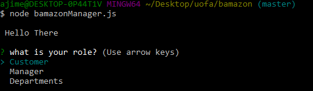
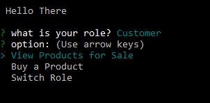
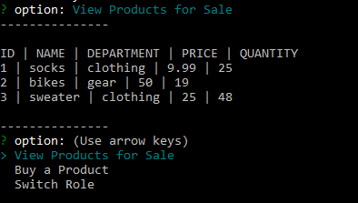
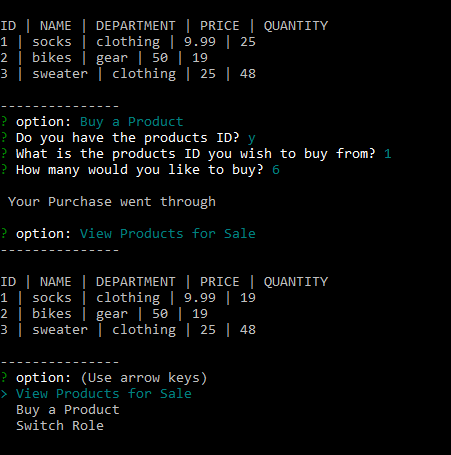
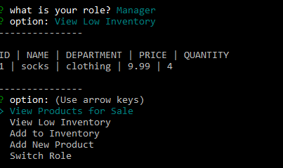
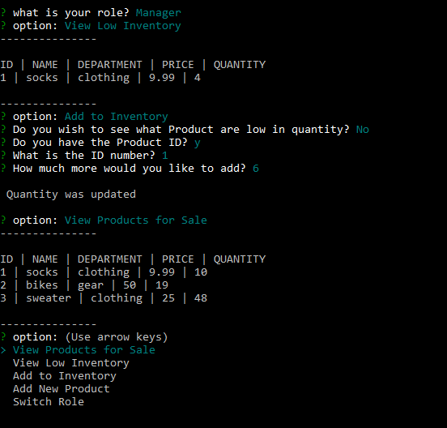
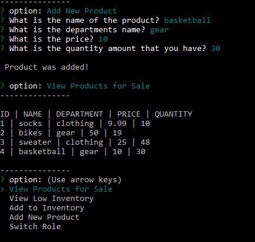
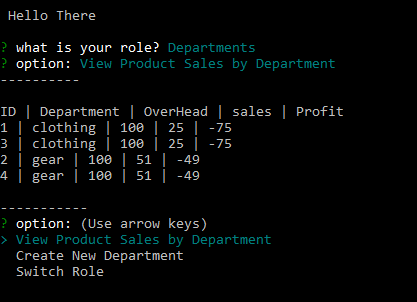

# bamazon
### when this program first starts this is what you see

# For the customer view you have these options

### This is how the customer sees the items ( *This is how it also looks for the manager )

### When the customer wants to buy something this is what the user will see
##### It first asks you a question if you got the product ID, If the user does not it shows the all products so the user can get it
##### Then the user has to input the ID number which gets valided, Then finally how much of the product would you like to buy

### For the manager side, the user will see these options
##### and for example if the user would want to know what items are low in quantitys, this is what the user will see

##### if there is something lower than 5 for quanitiy 

### if a Manager would want to add to a exsisting inventory this is how it would look like

### to add a new product

# to see the stats for the departments
### to create a new department this would just route to the manager side "add a new product" but after just gets routing back to dept

